<h1 align="center">Kumud Mishra</h1>

<b>4th Year CSE Undergrad · Building toward AI/ML + Backend roles</b>

  
  
  

  

---

### currently

- 🎓 Final year, Computer Science & Engineering
- 🎯 Prepping for AI/ML + Backend Engineer roles
- 🛠️ Shipping small projects end-to-end — model → API → UI

### stack

**Languages** &nbsp; `C++` `C` `Python` `Java` `JavaScript` `SQL` `HTML/CSS`

**Web** &nbsp; `React` `Node.js` `Express.js` `Flask` `Streamlit`

**ML / AI** &nbsp; `PyTorch` `TensorFlow` `Scikit-learn` `Pandas` `Matplotlib` `Plotly`

**Data** &nbsp; `MySQL` `MongoDB` `PostgreSQL`

**Tools** &nbsp; `Git` `GitHub` `VS Code` `Google Colab` `Vercel`

### pinned work

<table>
<tr>
<td width="50%" valign="top">

**[Aura-agent](https://github.com/kumud1606/Aura-agent)**
Python-based AI agent project.

</td>
<td width="50%" valign="top">

**[compiler-LL-1-_PARSER_VISUALIZER](https://github.com/kumud1606/compiler-LL-1-_PARSER_VISUALIZER)**
LL(1) parser + visualizer, C++.

</td>
</tr>
<tr>
<td width="50%" valign="top">

**[RideMatch](https://github.com/kumud1606/RideMatch)**
Ride-matching system, Go.

</td>
<td width="50%" valign="top">

**[clg_events_manager](https://github.com/kumud1606/clg_events_manager)**
College events manager, JavaScript.

</td>
</tr>
</table>

heatmap + info card regenerate automatically every day via GitHub Actions — see <code>.github/workflows/update.yml</code>

